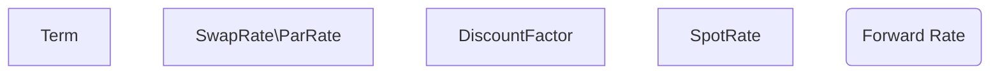

# Macroeconometirc-Models-and-Yield-Curve-Sensitivity
Miscellaneous practical macroeconometric models and tools in analysing yield curve.

- - -
### 1. Basics

#### 1.1 Exchange Rate
**Interest rate parity:**
under the assumption of **capital mobility** and **perfect substitutability** of demostic and foreign assets.
**uncovered:**
$$
C_t \times (1+i_{A}) = \frac {C_t \times E({ER}_{t+k})\times(1+i_B)}{{ER}_t},
$$
or
$$
(1+i_{A}) = \frac {E({ER}_{t+k})}{{ER}_t}\times(1+i_B)
$$
where $i_A$ and $i_B$ are risk free rates in country A and B, ${ER}_t$ is the exchange rate from currency $A$ to $B$ at time $t$, $E()$ is expectation.
**covered:**
$$
(1+i_{A}) = \frac {F_t}{{ER}_t}\times(1+i_B),
$$
$F_t$ is the forward exchange rate at time $t$.

An approximated version:
$$
i_A = i_B + \frac {\Delta E({ER}_{t+k})} {{ER}_t},
$$
where $\frac {\Delta E({ER}_{t+k})} {{ER}_t}$ is the expected rete of deprecation of currency $A$.

### 2. Macroecomic indicators nowcasting
Important macroecomic indicatorys like GDP and CPI are always released with a substantial delay. As a matter of fact, many indicators with much more higer frequency made it possible to get a early picture of the evolution fo current economic state. Here are several methods can bridge the gap bewteen timely updated indicators and the delayed natioanal accounts.

#### 2.1 Bridge Model

business and consumer surveys 

Since indicators cover a wide range of shortterm macroeconomic phenomena, they can be used in different bridge equations for the main GDP components (namely, private consumption, government purchases of goods and services, fixed investment, inventory investment, exports, and imports), or directly at aggregate GDP level. In the first case, the model is labelled ‘demand-side’ BM(where GDP is predicted by the NA income –expenditure identity), in the second case, it is labelled ‘supply-side’ BM (where GDP is forecast by a single bridge equation 2 ).

**uinit root test**
for a random walk process, at any forcast horizon h, we have:
$$ 
E(p_{h+t})=E(E(p_{h+t}|p_{h+t-1}))=E(p_{h+t-1})=...=E(p_{h+1})=p_{h},
$$
the expectaction of any future value is simply current value, it does not show any mean reverting property(non-stationary).
MA representation of a random walk:
$$
p_t=\alpha_t+\alpha_{t-1}+\alpha_{t-2}+...,
$$
the $l$ step forcast error is:
$$
e(l)= \alpha_{h+l}+\alpha_{h+l-1}+\alpha_{h+l-2}+...+\alpha_{h+1},
$$
and $Var(e(l))=l\sigma^2$ approaches infinity as $l$ increases. The acf will also show strong memory, the model is not predicable.

**accounting indentity:**
$$ total\ supply = total\ demand $$

**brige equition:**
Let $Y_\tau$ represent the varable of interest in quarter $\tau$, $I_\tau$ is the high frequency indicor vectors in quarter $\tau$. Then we have:
$$
Y_\tau = f(I_\tau,X_\tau)+\epsilon,
$$
$I_{\tau,t}$ is the t-th month's high frequency indicor vector of quarter $\tau$, missing $I_{\tau,t}$ in $I_\tau$ can be filled with ARIMA.

**reference:**
Parigi G, Schlitzer G. Quarterly forecasts of the italian business cycle by means of monthly economic indicators[J]. Journal of Forecasting, 1995, 14(2):117–141.

### 3. Bond Portfolio Logics

#### 3.1 Yield Curve

##### 3.1.1 Types of Yield Curves
keywords:
**quote convensions:** spot, forward and par rates

**Curve of discount: ** $d(t)$ gives the present values of one unit of currency to be received at various time t.
$$
C_{present} = D_{t_1}d(t_1) + D_{t_2}d(t_2) + D_{t_3}d(t_3)+...+ D_{t_n}d(t_n)
$$
**Spot rate** is the rate on a **spot** loan, **coumound spot rate is the inverse of d(t)**
$$
r_{spot}= \frac{1}{d(t)^{\frac{1}{t}}}-1
$$
like discount factor, spot rate are calculated ==**recursively**==
embedded
investment horizon
term in years

##### 3.1.2 Performance Analysis on Yield Curves
keywords:
**measure convensions:** returns, spreads and yields

**Returns** have to account for **intermediate cash flows(with reinvestment and financing cost)** and are often computed both on a gross basis and net of(deduct) financing.
$$
r_{realized}=\frac {D_{t_1}\times(1+r_{reinvest_1})^{T-t_1} + 
D_{t_2}\times(1+r_{reinvest_2})^{T-t_2}+...+
D_{t_n}\times(1+r_{reinvest_n})^{T-t_n} - C\times(1+r_{financing})^T
} {C}
$$
**Spread** is essential for **relative value** and their convergence or divergence is an important source of return(spread will be analysised in detail in chapter 3.2).

**Yield to Maturity**
yield to maturity equals par rate when spot price equals par value.

**coupon effect: **for yield is a complex average of all the spot rates of all the cash flows to the bonds' maturity, If the yields curves are positively sloped, a fairly priced zero coupon bond's yield(equals to it's spot rate) is higher than a coupon bond's yield with the same maturity. The implacation of this effect is that yield is not a reliable measure of relative value.

P&L Decompostion
**Price Appreciation**
**Cash Carry**
**Carry Roll Down**

##### 3.1.3 Risk Analysis on Yield Curves

#### 3.2 Profit Sources
##### 3.2.1 Credit Spread
##### 3.3.2 Yield Spread
