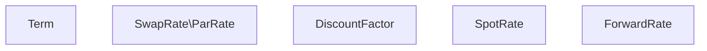
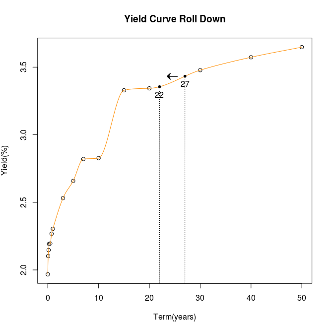
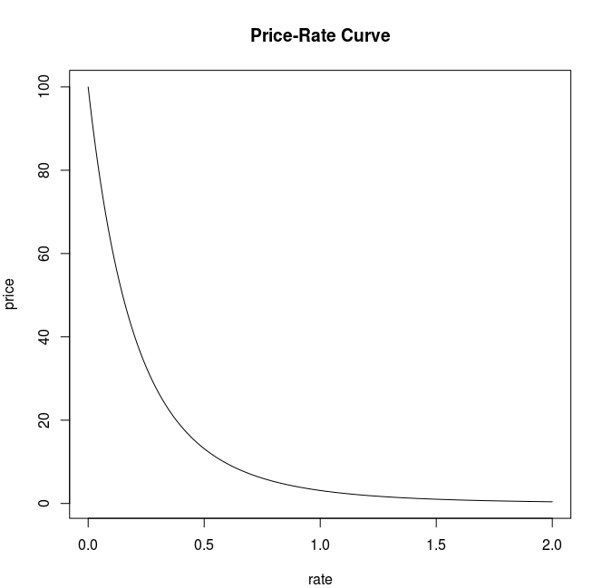
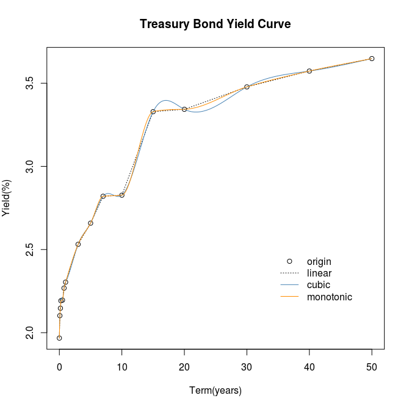

# Macroeconometirc-Models-and-Yield-Curve-Sensitivity
Miscellaneous practical macroeconometric models and tools in analysing yield curve.

- - -
### 1. Basics
credit, interest rates, leveraging and deleveraging
#### 1.1 Interest Rate

**Interest rate parity:**
under the assumption of **capital mobility** and **perfect substitutability** of demostic and foreign assets.
**uncovered:**
$$
C_t \times (1+i_{A}) = \frac {C_t \times E({ER}_{t+k})\times(1+i_B)}{{ER}_t},
$$
or
$$
(1+i_{A}) = \frac {E({ER}_{t+k})}{{ER}_t}\times(1+i_B)
$$
where $i_A$ and $i_B$ are risk free rates in country A and B, ${ER}_t$ is the exchange rate from currency $A$ to $B$ at time $t$, $E()$ is expectation.
**covered:**
$$
(1+i_{A}) = \frac {F_t}{{ER}_t}\times(1+i_B),
$$
$F_t$ is the forward exchange rate at time $t$.

An approximated version:
$$
i_A = i_B + \frac {\Delta E({ER}_{t+k})} {{ER}_t},
$$
where $\frac {\Delta E({ER}_{t+k})} {{ER}_t}$ is the expected rete of deprecation of currency $A$.

**Negative interest rate:**
[Incentive](http://www.investopedia.com/articles/investing/070915/how-negative-interest-rates-work.asp): as the **DEMAND** of a country is low, people and businesses have a tendency to hold on to their cash while they wait for the economy to pick up. But this behavior can serve to weaken the economy further as the lack of spending causes further job losses and lower profits, thus reinforcing people’s fears and giving them even more incentive to **hoard**. As spending slows, prices drop creating another incentive for people to wait as they wait for prices to fall further. This is called a **'deflation spiral'**.
**Methods:**  large-scale bond-buying programs and negative deposit rates.
Negative interest rates are a drastic measure that show policymakers are afraid that Europe is at risk of falling into a deflationary spiral.
+ As private sector banks have to pay to central bank(excess reserve) to park their money, negative rates hope to encourage banks to lend more.
+ Central bank charge priate sector banks, also private banks will charge depositors. This will encourage people to save less but lend more.
+ Negative yield on sovereign **financial assets** will deter foreign investors, **weaking demand for local currency(sovereign financial assets are priced and traded with local currency)**. While decrease in currency lowered its value, this will stimulate demand for the export of **non financial assets**, hopefully encourage business to expand.
+ But negative rates may also cause bank to lend less, and deposit holders may withdraw their money and stuff them in mattresses.

### 2. Macroecomic indicators nowcasting
Important macroecomic indicatorys like GDP and CPI are always released with a substantial delay. As a matter of fact, many indicators with much more higer frequency made it possible to get a early picture of the evolution fo current economic state. Here are several methods can bridge the gap bewteen timely updated indicators and the delayed natioanal accounts.

#### 2.1 Bridge Model

business and consumer surveys 

Since indicators cover a wide range of shortterm macroeconomic phenomena, they can be used in different bridge equations for the main GDP components (namely, private consumption, government purchases of goods and services, fixed investment, inventory investment, exports, and imports), or directly at aggregate GDP level. In the first case, the model is labelled ‘demand-side’ BM(where GDP is predicted by the NA income –expenditure identity), in the second case, it is labelled ‘supply-side’ BM (where GDP is forecast by a single bridge equation 2 ).

**uinit root test**
for a random walk process, at any forcast horizon h, we have:
$$ 
E(p_{h+t})=E(E(p_{h+t}|p_{h+t-1}))=E(p_{h+t-1})=...=E(p_{h+1})=p_{h},
$$
the expectaction of any future value is simply current value, it does not show any mean reverting property(non-stationary).
MA representation of a random walk:
$$
p_t=\alpha_t+\alpha_{t-1}+\alpha_{t-2}+...,
$$
the $l$ step forcast error is:
$$
e(l)= \alpha_{h+l}+\alpha_{h+l-1}+\alpha_{h+l-2}+...+\alpha_{h+1},
$$
and $Var(e(l))=l\sigma^2$ approaches infinity as $l$ increases. The acf will also show strong memory, the model is not predicable.

**accounting indentity:**
$$ total\ supply = total\ demand $$

**brige equition:**
Let $Y_\tau$ represent the varable of interest in quarter $\tau$, $I_\tau$ is the high frequency indicor vectors in quarter $\tau$. Then we have:
$$
Y_\tau = f(I_\tau,X_\tau)+\epsilon,
$$
$I_{\tau,t}$ is the t-th month's high frequency indicor vector of quarter $\tau$, missing $I_{\tau,t}$ in $I_\tau$ can be filled with ARIMA.

**reference:**
Parigi G, Schlitzer G. Quarterly forecasts of the italian business cycle by means of monthly economic indicators[J]. Journal of Forecasting, 1995, 14(2):117–141.

### 3. Bond Portfolio Logics

#### 3.1 Yield Curve

**Instruments:**
+ **Forward forward(forward loan):** an agreement between two parties to engage in a loan transaction in the future. The lender agrees to lend the borrower funds on a specified future date. The borrower agrees to repay the loan, plus a premium, at a date beyond the loan issue date.
example: a 10000 6-month loan, 10 years forward = a 10000 loan made in 10 ten years for 6 months = the lender give 10000 to the borrower 10 years later,  the brower repay the loan 6 months after the payment(i.e. 10.5 years).
+ **Premium/Discount bond: ** a coupon bond that is trading above/below its par value(when its coupon rate is higher/lower than the **prevailing interest rate**)
+ **Par bond: ** a coupon bond trade at par.
+ **Zero coupon bond:** sold at a significant discount to face value and offer no interest payments because they mature at par. **STRIPS**(Separate Trading of Registered Interest and Principal of Securities) is a kind of zero coupon bond issued by US government.

##### 3.1.1 Types of (EXPECTED) Yield Curves
keywords:
**quote convensions:** spot, forward and par rates
##### Essential: Law of one price
If any of the discount, spot, par or forward curve is known, the other three curves are determined.
+ **Par rate:  $r_{par}(t)$ is the implied par rates under a given term structure, or a given set of par rates implied(determined) a term structure. Par rate is the implied coupon rate if all bonds are trade at par(but not their current price). If any of the Par rates or discount factors are konwn, the other can be determined by the following equation: **
$$
r_{par}(T) \times Par \times A(T)+Par \times d(T) = Par
$$
devied Par on both sides:
$$
r_{par}(T) \times A(T)+d(T) = 1
$$
**Because the fixed leg of IRS is the same with a par bond, IRS rate are always take as the real par rates.**
+ **Discount factor: ** $d(t)$ gives the present values of one unit of currency to be received at various time t.
$$
\begin{align*}
C_{present} &= D_{t_1}d(t_1) + D_{t_2}d(t_2) + D_{t_3}d(t_3)+...+ D_{t_n}d(t_n) \\
&=cash\ flow\cdot A(T),
\end{align*}
$$
where $\cdot$ denote dot product(or inner product), $A(T)=d(t_1)+...+d(T)$ denote annuity factor. Each $d(t_i)$ can be easily calculated 
+ **Spot rate** is the rate on a **spot** loan, **coumound spot rate is the inverse of d(t)**
$$
r_{spot}= \frac{1}{d(t)^{\frac{1}{t}}}-1
$$
+ **Forward rate** is the rate of a **forward loan**. a 1-period loan, $t-1$ periods forward
$$
(1+r_{forwrd})=\frac {d_{t-1}} {d_t}
$$
$$
(1+r_{spot})^t=\prod_{i=0}^{t-1} (1+r_{forward_{t-i}})
$$
like discount factor, spot rate are calculated ==**recursively**==

embedded
investment horizon
term in years

##### 3.1.2 Performance Analysis on Yield Curves
keywords:
**measure convensions:** returns, spreads and yields

**Returns** have to account for **intermediate cash flows(with reinvestment and financing cost)** and are often computed both on a gross basis and net of(deduct) financing.
$$
r_{realized}=\frac {D_{t_1}\times(1+r_{reinvest_1})^{T-t_1} + 
D_{t_2}\times(1+r_{reinvest_2})^{T-t_2}+...+
D_{t_n}\times(1+r_{reinvest_n})^{T-t_n} - C\times(1+r_{financing})^T
} {C}
$$
**Spread** is essential for **relative value** and their convergence or divergence is an important source of return(spread will be analysised in detail in chapter 3.2).

**Yield to Maturity**
yield to maturity equals par rate when spot price equals par value.

**coupon effect: **for yield is a complex average of all the spot rates of all the cash flows to the bonds' maturity, If the yields curves are positively sloped, a fairly priced zero coupon bond's yield(equals to it's spot rate) is higher than a coupon bond's yield with the same maturity. The implacation of this effect is that yield is not a reliable measure of relative value.

**Also, spot rate is a geometric mean of forward rate**

P&L Decompostion
#### **Essential: intermediate term structure**

 Let $P_t$ denote the full price of a bond, $p_t$ denote its net price(quoted price), and $AI(t)$ denote its accrued interest, so that $P_t=p_t+AI(t)$. Note that $AI$ only relys on $t$, as long as coupon rate is fixed, **$AI$ is independent of term structure**.
**Total Appreciation**: 
$$
\begin{align*}
total\ appreciation&=price\ appreciation+cash\ carry \\
&=carry\ roll\ down+rate\ change+spread\ change+cash\ carry.
\end{align*}
$$
** carry roll down, rate change and spread change are all with respect to net price.**
**Cash Carry: ** 
$$
\begin{align*}
{cash\ carry} &={coupon\ income}- {financing\ cost}\\
&=coupon\ payments+AI(t+1)-AI(t)-financing\ cost\\
&= (Coupon_{per\ day}-financing\ cost_{per\ day})\times d
\end{align*}
$$
where $d$ denote the number of days between $t$ and $t-1$.

**Price Appreciation** 
$$p_{t+1}(R_{t+1},S_{t+1})-p_{t}(R_{t},S_{t})$$
**Roll Down: ** the profit or lose due to the fact that, as a security **matures**, its cash flows are priced at earlier points on the term structure(for example a forward loan or an european option).
For example, A bond maturer in 27 years is bought at time $t$, after 5 years the bond's maturity becomes 22 years. If the yield curve stays the same, then the **net** price change due to rate rolling down form a longer maturity to a shorter maturity is called "roll down".

**Carry Roll Down: ** P&L that might otherwise be classified as either carry(interest inceome) or roll-down(rate change), carry roll down is the price appreciation due to the bond's maturing over the period and retes moving from the original term structure $R_t$ to some hypothetical,'expected',or intermediate term structure $R_{t+1}^e$
$$p_{t+1}(R_{t+1}^e,S_{t})-p_{t}(R_{t},S_{t})$$
**Rate Change**
$$p_{t+1}(R_{t+1},S_{t})-p_{t+1}(R_{t+1}^e,S_{t})$$
**Spread Chnage**
$$p_{t+1}(R_{t+1},S_{t+1})-p_{t+1}(R_{t+1},S_{t})$$
clearly, **adding carry-roll-down, rate-change and spread-change together will get price-appreciation**
**NOTE:**
1. $R$ represents a specifiede term structure, when the term sructure is spot curve, the whole curve at $t+1$ will be used in calculating terminal price, when $R$ is yield curve, only the rate roll downed to a corresponding point on the curve will be used.
2. All the decomposed components of price appreciation are represented by **net prices**, but we can only get **full prices** with a specified term strucutre and spread. note that $P_t=p_t+AI(t)$, and $AI$ is irrevelant to term structure and spread. Replace net prices with full prices and accrued interest will get:
$carry\ roll\ down= P_{t+1}(R_{t+1}^e,S_{t})-P_{t}(R_{t},S_{t})-AI(t+1)+AI(t),\\
rate\ change=P_{t+1}(R_{t+1},S_{t})-P_{t+1}(R_{t+1}^e,S_{t}),\\
spread\ change=P_{t+1}(R_{t+1},S_{t+1})-P_{t+1}(R_{t+1},S_{t}).$

spread fixed
calculate in advance
too cheap
too expensive

fall/rise in parallel

##### 3.1.3 Risk Analysis on Yield Curves
Yield curve can be decomposed in to several interest rate factors, these factors can be as simple as "level" and "slope", or as complex as every point on the curve is a factor(not decomposed at all)

#### **Essential: price-rate curve**

convex: straight line lies above the curve.
concave: stratght line lies below the curve.
**01** represents .01%, i.e. one basis point. (DV01, key-rates 01, ...)

##### Single risk factor
Risk factor :
$$y$$
usually yield rate is taken as risk factor $y$.
**DV01**: **dollar value change** of one basis point rate change.
$$
DV01=\frac{-\Delta P}{10000\times\Delta y} = \frac{-1}{10000}\frac{dP}{dy},
$$
where $dy$ is the rate change **in basis points**, $dP$ is the price change in dollars.

**Duration**: **percentage change** in the value of the security of one unit change in rates.
$$
D=\frac{-1}{P} \frac{dP}{dy}, \ or\\
\frac{\Delta P}{P} = -D\Delta y .
$$
For example, if the rate change m basis points, Duration is D, then price change -D\*m basis points.

**convexity:** measure interest rate sensitivity changes with the level of rates(sensitivity of the price sensitivity of rate change).
$$
C=\frac{1}{P} \frac{d^2P}{dy^2}
$$
when concexity is positive, the security is said to have positive sensitivity. Graphically this means that its price-rate is convex(i.e. its DV01 or duration fall as rates increase).

A second-order Taylor approximation of the price-rate function with respect to rates:
$$
P(y+\Delta y)=P(y)+\frac{dP}{dy}\Delta y + \frac{1}{2}\frac{d^2P}{dy^2}\Delta y^2, or \\
\Delta y = P(y+\Delta y)-P(y)=\frac{dP}{dy}\Delta y + \frac{1}{2}\frac{d^2P}{dy^2} \Delta y^2, or\\
\frac{\Delta P}{P}=-D\Delta y +\frac{1}{2}C\Delta y^2.
$$
As from the third equation, **convexity is an exposure to volatility**. A portfolio with higher convexity is to long the volatility, for $\Delta y^2$ will rise with volatility, and a larger cnvexity will contribute more to the proportion of value.

The value of a portfolio equals the sum of the **value** of the individual securities in the portfolio:
$$
P=\sum P_i,
$$
where$P_i$ is the $i_{th}$ securities' value. There's a simple relation between each securities' risk measure and the portfolio.
$$
DV01=\sum DV01 \\
D=\sum \frac{P_i}{P}D_i \\
C=\sum \frac{P_i}{P}C_i
$$

the reason multiplying a $\frac{1}{(1+y)}$ with $\frac{dP}{dy}$ is to make the $t-1$th power be $t$ again, then duration can be seen as a weighted(**weights are determined by the proportion of the cash flows to the total present value**) sum of all the cash folow time duration.
$$duration \propto maturity \\
convexity \propto {maturity}^2 \propto {duration}^2$$
If barbell portfolio A consists of two bonds with duration $d_1$ and $d_2$, portfolio B is a bullet portfolio with duration $d_3$. According to the duration relations between securitie and portfolio, $d_1,d_2,d_3$ satisfy:
$$
wd_1+(1-w)d_2=d_3,
$$
It's easy to proof that the following equation must hold:
$$
wd_1^2 + (1-w)d_2^2>d_3^2.
$$
i.e. **A barbell portfolio will have a larger convexity than and a bullet portfolio with the same duration**. If future interest rate is highly volatile, barbell is preferred than bullet, vise versa.
##### Multiple risk factors
steepen: shorter-term rates fall **by** more than longer-term rates, or longer-term rates increase by more than shorter-term rates.
flatten: shorter-term rates increase by more than longer-term rates, or longer-term rates fall by more than shorter-term rates.
though graphically the curve may not seen as 'flatten' or 'steepen'.

#### 3.2 Bond Pricing

**Callable bonds** can be decomposed into bond and bond's call option, while **puttable bonds** can be decomposed into bond and bond's put option.

##### 3.2.1 Credit Spread
##### 3.3.2 Yield Spread

#### 3.3 Tools and Models

##### interpolation

**linear interpolation**
**Cubic spline**
[spline](https://en.wikipedia.org/wiki/Spline_interpolation) was a term for elastic rulers that were bent to pass through a number of predefined points ("knots"). The approach to mathematically model the shape of such elastic rulers fixed by n + 1 knots $\{(x_i,y_i),i=0,1,...,n\}$is to interpolate between all the pairs of knots ${(x_{i-1},y_{i-1})}$ and $(x_{i},y_{i})$ with polynomials $ y=q_{i}(x),i=1,2,\cdots ,n$.
$q_i(x)$ satisfies the form
$$
q_i(x)=P_1y_{i-1}+P_2y_{i}+P_3k_{i-1}+P_4k_{i}.
$$
Where $P_j,j=1,2,3,4$ are **basis functions**, different forms of $P_j$ result in different types of cubic spline(e.g. cubic spline, hermit cubic spline, monotonic cubic spline), the **only difference between cubic spline methods is the from of** $P_j$.  $k_{i-1}$ and $k_i$ are the tangent values at the knots of the $i_{th}$spline. **The goal of any spline method is to find each knot's tangent value ** $k_i,i=0,1,...,n$ **by some prespecified conditions**, once all $k_i$ are known, the interpolation polynomial is set.
For a polynominal to be smooth, a continuous second derivative is required. That is
$$
q_{i+1}''(x)=q_i''(x),i=1,...,n-1.
$$
This condition will generate $n-1$ equations, but we have $n+1$  $k_i$s. Two more equations are needed to get all $k_i$s. For the elastic rulers being the model for the spline interpolation one has that to the left of the left-most "knot" and to the right of the right-most "knot" the ruler can move freely and will therefore take the form of a straight line with $q′′ = 0$. One gets that for **Natural Spline** conditions in addition to the previous $n-1$ equations:
$$
q_0''(x)=0, \\
q_n''(x)=0.
$$
Eventually, conditions above constitute $n+1$ linear euqations with $n+1$ unkonwn varibles.
**[Monotonic Hermit Spline](https://en.wikipedia.org/wiki/Monotone_cubic_interpolation)**
As to Monotonic Hermit Spline, the conditions needed to find $k_i$s are a little different, for the constrains on second derivitives may not hold under monotonic condition. It is needed to specify all the tangents **manually**.

#### Chinese Land Price and Economy
